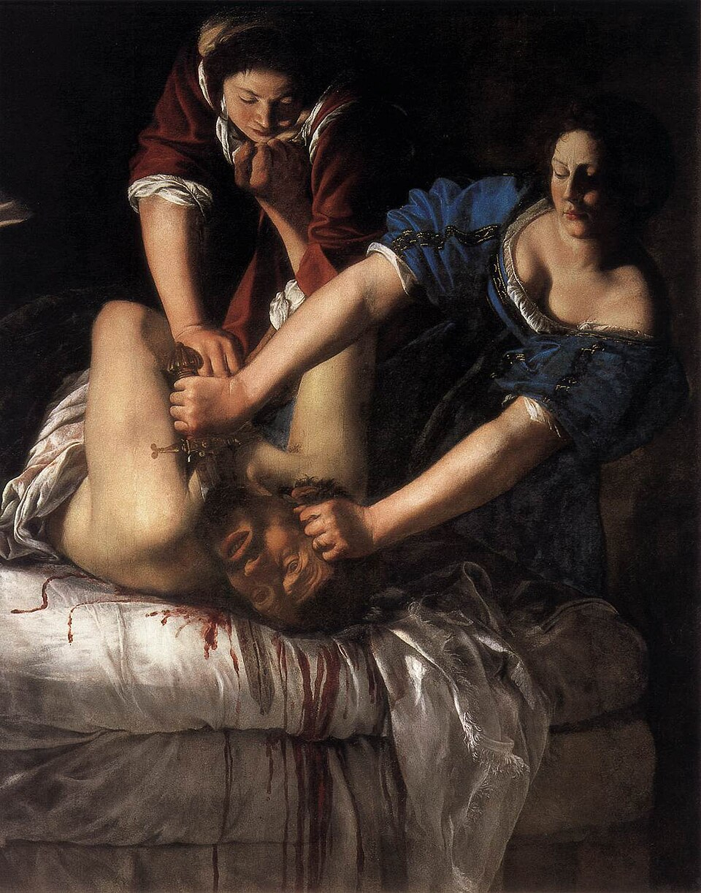

 
#  La terreur féministe

C'est un essai dont le but est de défendre l'idée que le féminisme sera mieux
défendu par des actions violentes puisque les actions pacifiques échouent
systématiquement.

Il sert également de recensement des travaux féministes centrés sur la violence
comme outil de destruction du patriarcat.

## La terreur féministe dans l'art

Irene présente plusieurs œuvres qui montrent les femmes comme prenant leur
revanche envers des hommes qui les ont directement ou indirectement blessées.

Elle décrit à quel point le [Male gaze](c21a47aa) est omniprésent dans les
représentations de viol et de revanche.

Elle mentionne notamment le travail de Artemisia Gentileschi qui a peint à
multiples reprises des femmes comettant des meurtres sur des hommes avec
froideur et certitude.

### Le SCUM Manifesto de Solanas

Irene parle du  [SCUM Manifesto](41c35505) comme étant une mention nécessaire au
sein du livre.

Elle explique néanmoins que les propos de Irene sont assez anti-féministes: "De
mon point de vue, Solanas n'est en aucun cas une figure à prendre enn exemple.
Son manifeste est intéressant à lire d'un point de vue critique, non pas pour
s'en inspirer [...]."

# Up

[Feminism](60c4cbbc)
[Terrorism](2556a1bb)

# Down

[Valerie Solanas](17d70997)
