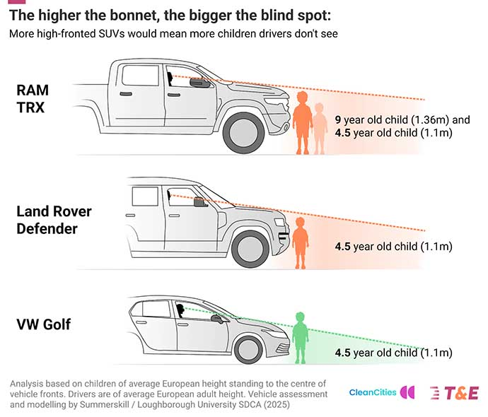
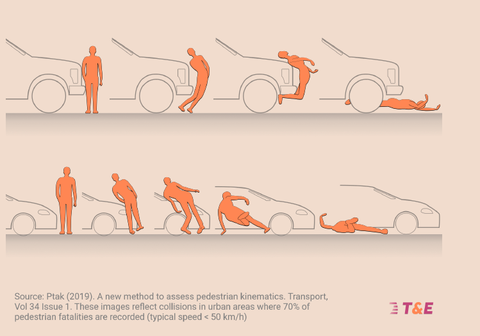

# Why are SUVs dangerous

## For pedestrians & cyclists

* Hood height creates a much bigger blindspot, which makes it far more complicated
to see what is right in front the vehicle.
  * SUV riders generally do not notice that they have a huge blindspot.

* The fact that the hood is higher and more vertical makes it much more likely to
kill the pedestrian or cyclist in the event of a collision.

* Higher chassis makes SUVs much more likely to jump a curb and hit pedestrians
  on the sidewalk.
* Increased feeling of safety encourages reckless driving

## For other drivers

* SUVs being bigger vehicles, they cause crashes with other vehicles to be much
  more likely to be fatal.

## For SUV drivers

* Since the center of gravity is much higher than a regular car, the SUV is more
  likely to rollover.
  * Rollover tests for vehicle safety have been introduced because of SUVs.
* At least in the USA, but likely also in Europe, the safety regulations on SUVs
  are more relaxed compared to all other road vehicle types.
* Increased feeling of safety encourages reckless driving

# Up

[Why SUVs are so popular in the USA](ab2b412a)

# Down
